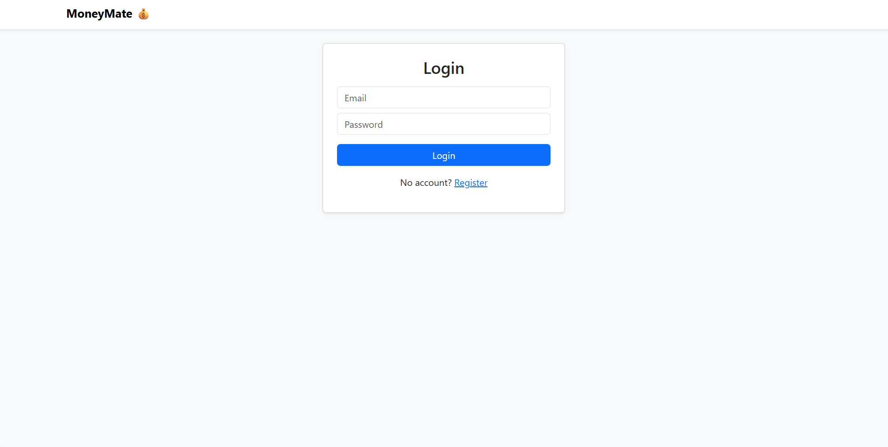
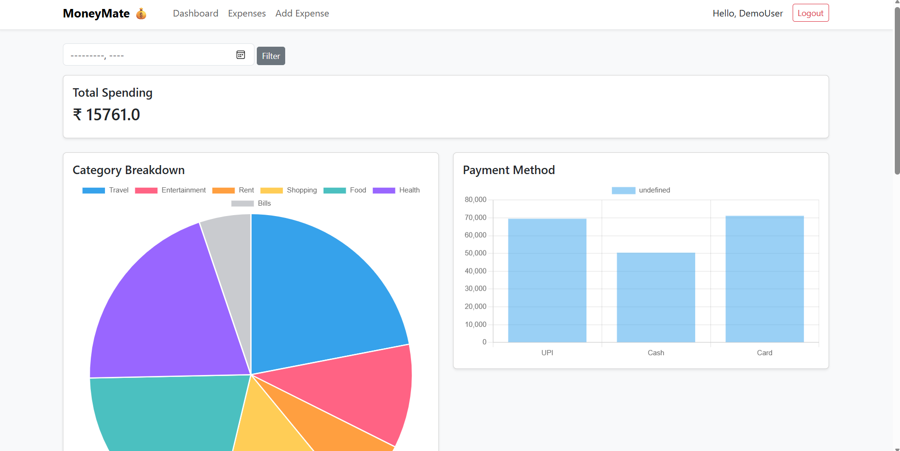
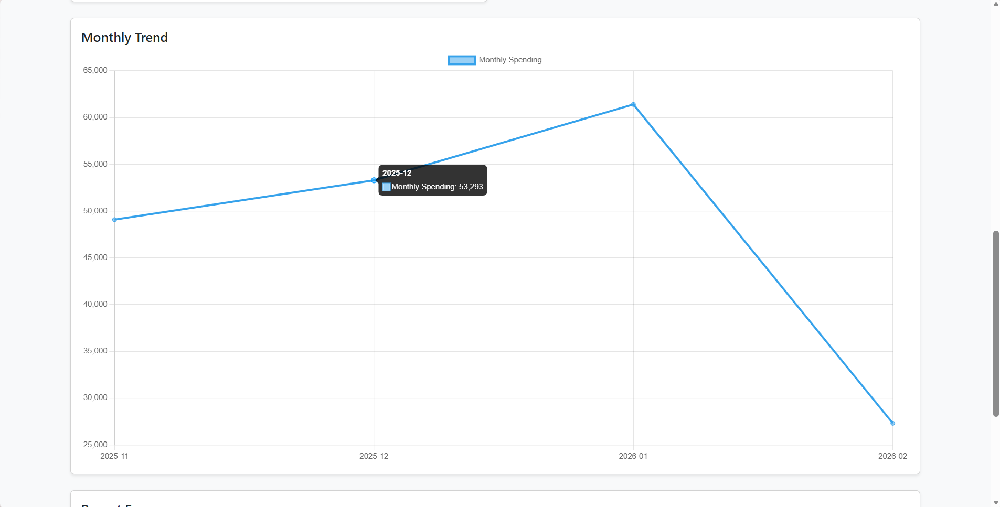
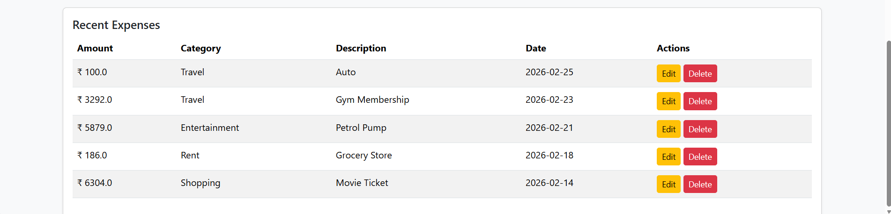
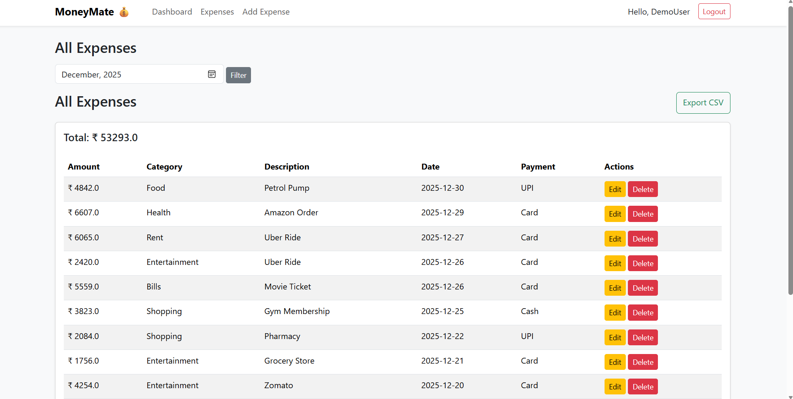
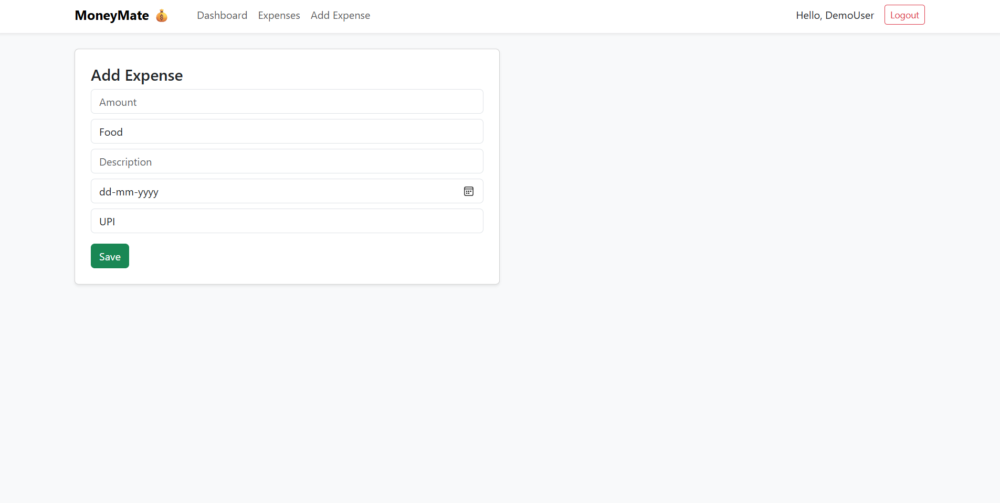

# 💰 MoneyMate – Expense Tracking Web Application

MoneyMate is a Flask-based web application designed to help users track and manage their daily expenses efficiently.

The application allows users to record transactions, categorize spending, and view financial data in an organized dashboard.

---

## 🚀 Features

- 🔐 User Authentication (Register / Login / Logout)
- ➕ Add expense transactions
- 🗂 Categorize expenses
- 💳 Track payment methods
- 📅 Filter transactions by month
- 📊 Visual representation of spending data
- 🗑 Delete transactions
- 🎨 Responsive Bootstrap UI

---

## 🛠 Tech Stack

- Python
- Flask
- SQLite
- SQLAlchemy
- Flask-Login
- Bootstrap 5
- Chart.js (for visualization)

---

## ⚙️ How It Works

1. Users register and log in securely.
2. Expenses can be added with:
   - Amount
   - Category
   - Payment method
   - Date
3. Transactions are stored in the database.
4. Users can view categorized and filtered expense data.

---

## ▶️ Installation & Setup

```bash
git clone https://github.com/YOUR_USERNAME/MoneyMate.git
cd MoneyMate
python -m venv venv
venv\Scripts\activate
pip install -r requirements.txt
python app.py
```

Open in browser:

http://127.0.0.1:5000

---

## 📸 Screenshots

###  Login Page


###  Dashboard View


###  Monthly Trend


###  Recent Expense


###  Expenses


###  Add Expense



---

## 📄 License

This project is developed for educational purposes.